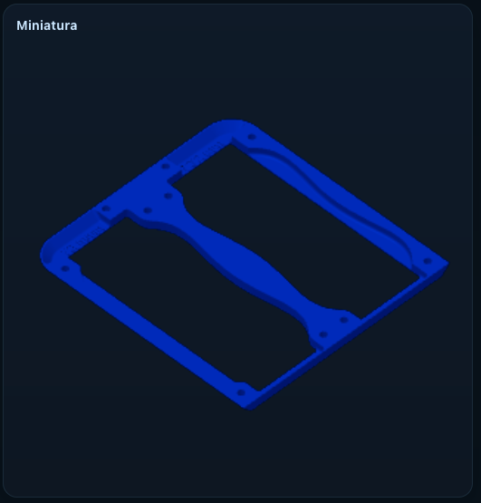
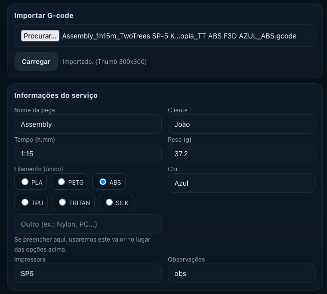
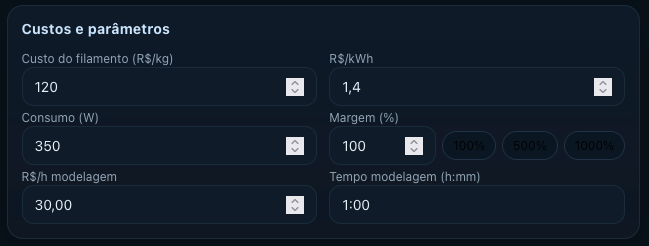
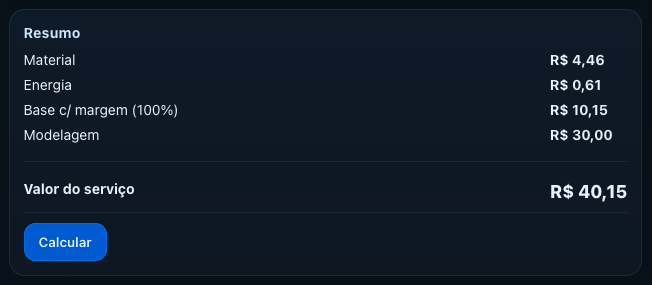

# Orçamento de Impressão 3D - Uso Pessoal

Ferramenta em HTML criada para meu uso pessoal, com a ajuda de I.A., que calcula o custo de impressões 3D a partir de arquivos **.gcode** gerados no OrcaSlicer.

O sistema lê automaticamente informações importantes e gera uma mensagem pronta para envio no WhatsApp.

## 📸 Galeria de uso

<p align="center">
  
  
</p>

<p align="center">
  
  
</p>

<p align="center">
  
</p>

## ⚙️ Configuração necessária no OrcaSlicer

1. **Miniatura no G-code**
   - Ative nas configurações para salvar **PNG 300x300**.

2. **Formato do nome do arquivo**
   - Em **G-code file name format**, use:
     ```
     {input_filename_base}_{print_time}_{printer_preset}_{filament_preset[0]}_{filament_type[0]}.gcode
     ```

---

## 🚀 Como usar
1. Abra o arquivo `index.html` no navegador ou acesse a versão online no GitHub Pages.
2. Clique em **Importar G-code** e selecione o arquivo.
3. Confira as informações extraídas automaticamente.
4. Clique em **Calcular** para gerar a mensagem do WhatsApp.
5. Envie para o cliente.
